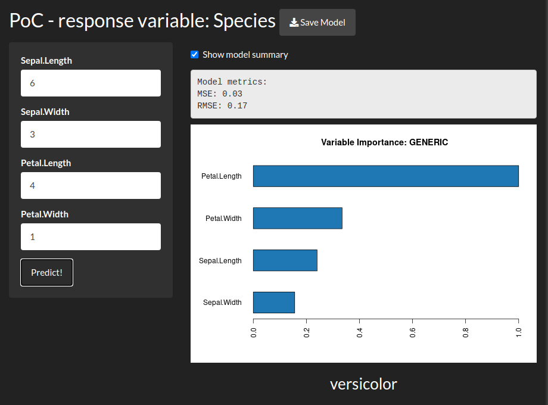

<!-- README.md is generated from README.Rmd. Please edit that file -->

# pocaAgua

**Proof of Concept of Artificial intelligence (POCA) with**
**[H2O](https://www.h2o.ai/) (AGUA)**

<!-- badges: start -->

[](https://www.tidyverse.org/lifecycle/#experimental)
<!-- badges: end -->

Easily fit various prediction models for a dataset. Get the metrics of
the best-calculated model, as well as a prediction test interface
through a web page.

Without user intervention, `pocaAgua` can be used for regression or
classification problems. Just provide the table and the response
variable to easily get an AI proof of concept.

## Installation

`pocaAgua` is currently only available as a GitHub package.

To install it, run the following from an R console:

``` r
if (!require("remotes")) {
  install.packages("remotes")
}
remotes::install_github("jcrodriguez1989/pocaAgua", dependencies = TRUE)
```

## Example

Get a predictions proof of concept for different datasets:

``` r
library("pocaAgua")

## Use it to classify the "Species" from the iris dataset.
poca_agua(iris, "Species")

## Use it to regress the "mpg" from the mtcars dataset.
poca_agua(mtcars, "mpg")

## If we have the table as a csv file we could do:
poca_agua("my_table.csv", "name_of_my_interest_variable")
```

Example app for the `iris` table:


